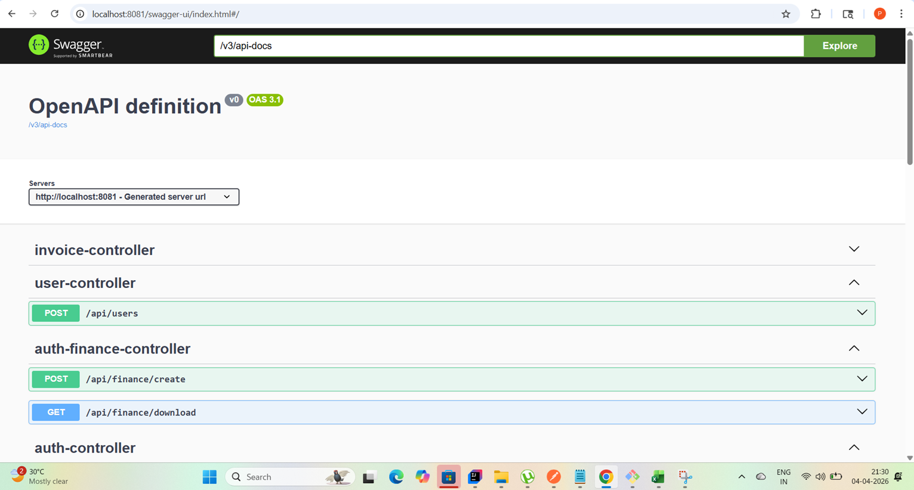
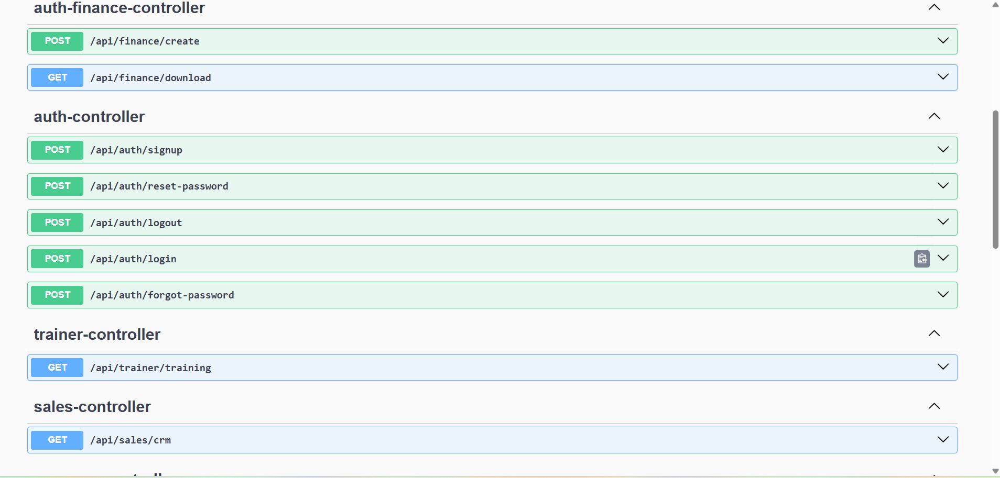
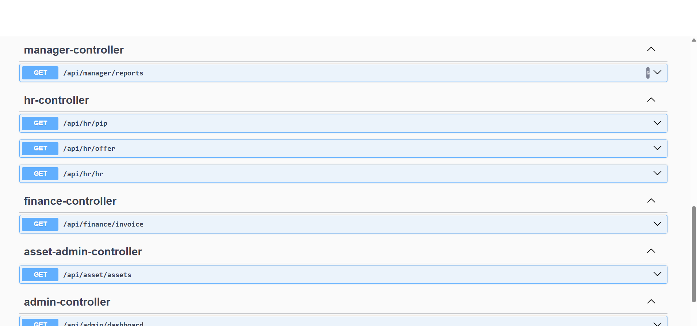
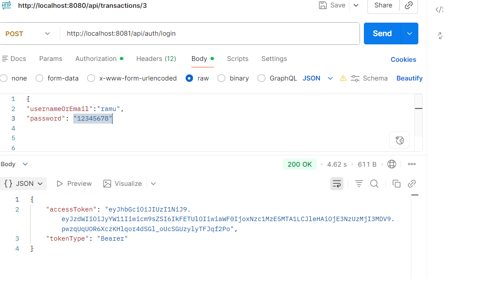
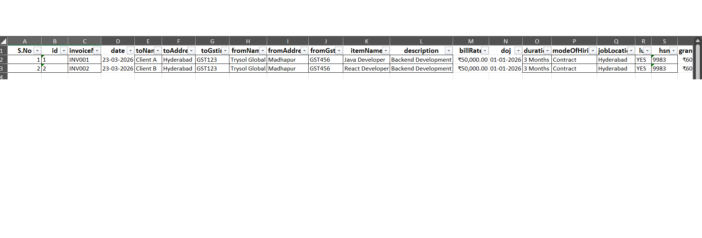

# 🚀 Trysol Enterprise Suite

> A production-ready **Spring Boot backend** showcasing **JWT Security, RBAC, Finance + Invoice systems, and Excel automation** — built to demonstrate real-world enterprise architecture.

---

## 🧠 Steps in this project

* 🔐 End-to-end **JWT Authentication + Authorization**
* 👥 Clean **Role-Based Access Control (RBAC)** across modules
* 📊 Real-world **Finance system with GST logic & margin calculation**
* 🧾 Advanced **Invoice Excel automation (create/update/delete in-place)**
* 🧱 Structured **layered architecture (Controller → Service → Repository)**
* ⚙️ Production-ready **Security Filter + Custom UserDetailsService**

---

## 🖼️ Demo Screenshots

### 🔹 Swagger UI




### 🔹 Login API Response


### 🔹 Finance Excel Output


### 🔹 Invoice Excel


## 🏗️ Architecture

```
Client (React/Postman)
        ↓
   Controller Layer
        ↓
   Service Layer (Business Logic)
        ↓
   Repository Layer (JPA)
        ↓
     Database (MySQL)


Security Flow:
         JWT 
          ↓
       Filter 
          ↓
       Validate  
          ↓
       Set Authentication 
            ↓
       Role Check
```

---

## 🔑 Core Modules

### 🔐 Auth Module

* Login / Signup
* Forgot & Reset Password
* JWT token generation with roles
* Secure password hashing (BCrypt)

### 👥 User & Roles

* Dynamic role assignment
* Roles: ADMIN, HR, FINANCE, SALES, TRAINER, ASSET_ADMIN, MANAGER

### 📊 Finance Module

* GST auto-calculation (CGST / SGST / IGST)
* Margin calculation
* Excel export with validation

### 🧾 Invoice Module

* Append records to Excel
* Update/Delete inside Excel (Apache POI)
* Auto styling (currency, date, borders)

---

## ⚙️ Tech Stack

* Java 17
* Spring Boot
* Spring Security
* JWT (jjwt)
* Spring Data JPA (Hibernate)
* MySQL
* Apache POI
* Lombok

---

## 🔐 Security Highlights

* Stateless authentication
* Custom `JwtFilter`
* Role-based endpoint protection
* Method-level security (`@PreAuthorize`)

---

## 📡 API Showcase

### 🔑 Login
       
```bash
curl -X POST http://localhost:8080/api/auth/login \
 -H "Content-Type: application/json" \
 -d '{"usernameOrEmail":"admin","password":"1234"}'
```

### 📊 Create Finance Record

```bash
curl -X POST http://localhost:8080/api/finance/create \
 -H "Authorization: Bearer <TOKEN>" \
 -H "Content-Type: application/json"
```

### 🧾 Create Invoice

```bash
POST /api/invoice/create-update
```

--- 

## 🔒 Role Access Matrix

| Module  | Roles          |
| ------- | -------------- |
| Admin   | ADMIN          |
| Finance | ADMIN, FINANCE |
| HR      | HR             |
| Sales   | SALES          |
| Trainer | TRAINER        |
| Assets  | ASSET_ADMIN    |
| Manager | MANAGER        |

---

## ⚡ Setup (Quick Start)

### 1. Clone

```bash
git clone <https://github.com/pavaneethreddyberravalli/Trysol-Enterprise-Suite>
cd trysol-enterprise-suite

```

### 2. Configure

```YML
spring:
  datasource:
    url: jdbc:mysql://localhost:3306/your_db
    username: your_username
    password: your_password

  jwt:
    secret: your_secret_key
    expiration: 3600000

  mail:
    username: your_email@gmail.com
    password: your_app_password
    
    
    


```
      
---
 ## Swagger
http://localhost:8081/swagger-ui/index.html


---
## 📦 Postman Collection (Recommended)


---

## 🚀 Deployment Ideas

* Backend → Render / Railway / AWS EC2
* DB → AWS RDS / PlanetScale
* Frontend → Vercel (React)

---

## 🧩 Future Improvements

* Refresh Tokens
* Email verification
* Pagination & filtering
* Audit logs
* Docker support

---

## 👨‍💻 About Me

**Pavaneeth Reddy**
Java Full Stack Developer

---   
